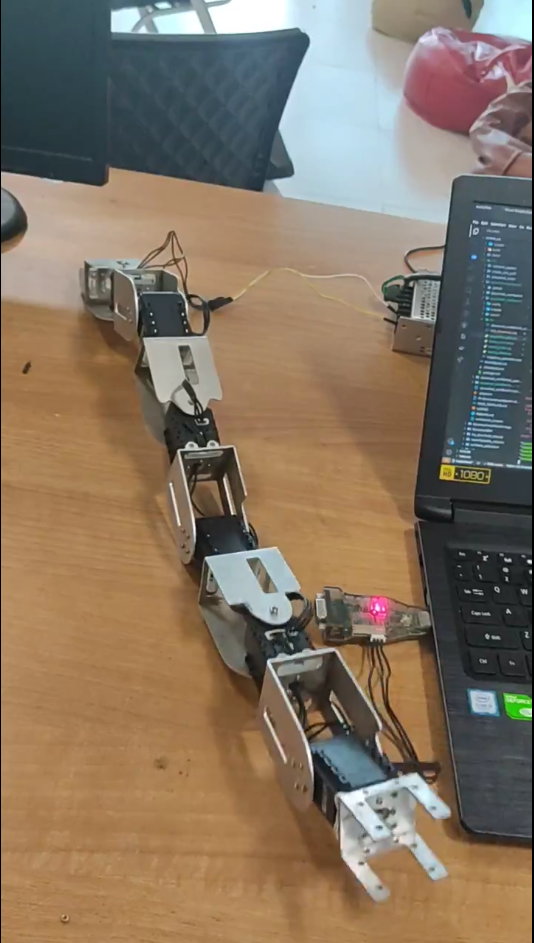

# Serpentine Gaits

## Serpentine model was created using aluminium links and AX-12 dynamixel motors were used for joints.

### Catepiller motion:

|  | |  | |
|------------------|------------|------------|---------------|
### Linear Undulaition:

|  | |  | |
|------------------|------------|------------|---------------|
### Side winding:

|  | |  | |
|------------------|------------|------------|---------------|
### Rolling:

|  | |  | |
|------------------|------------|------------|---------------|
